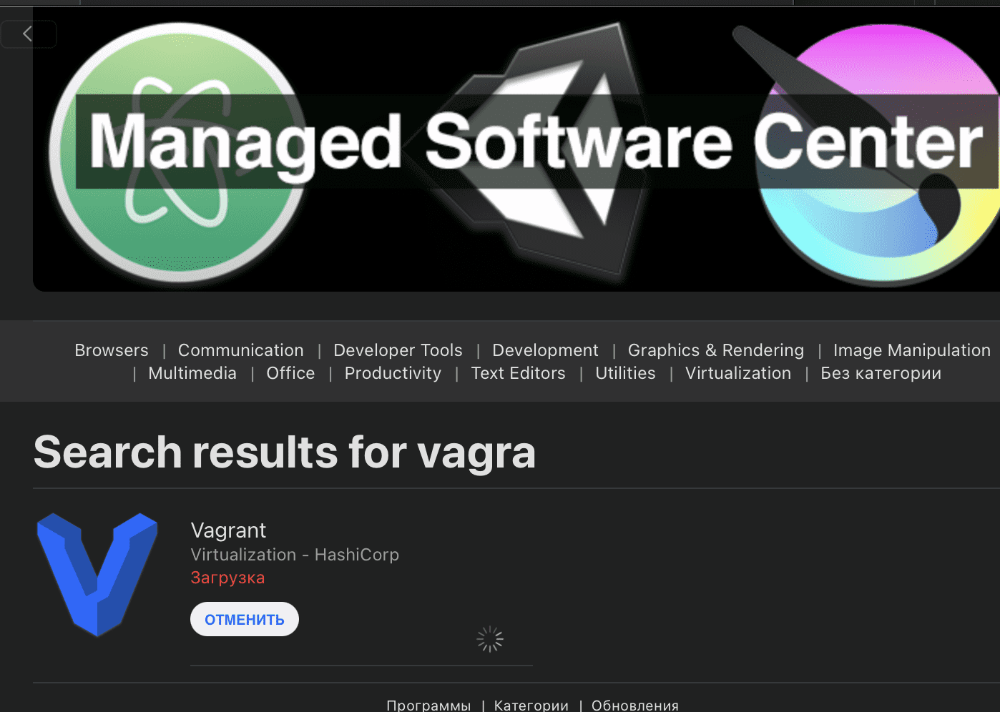
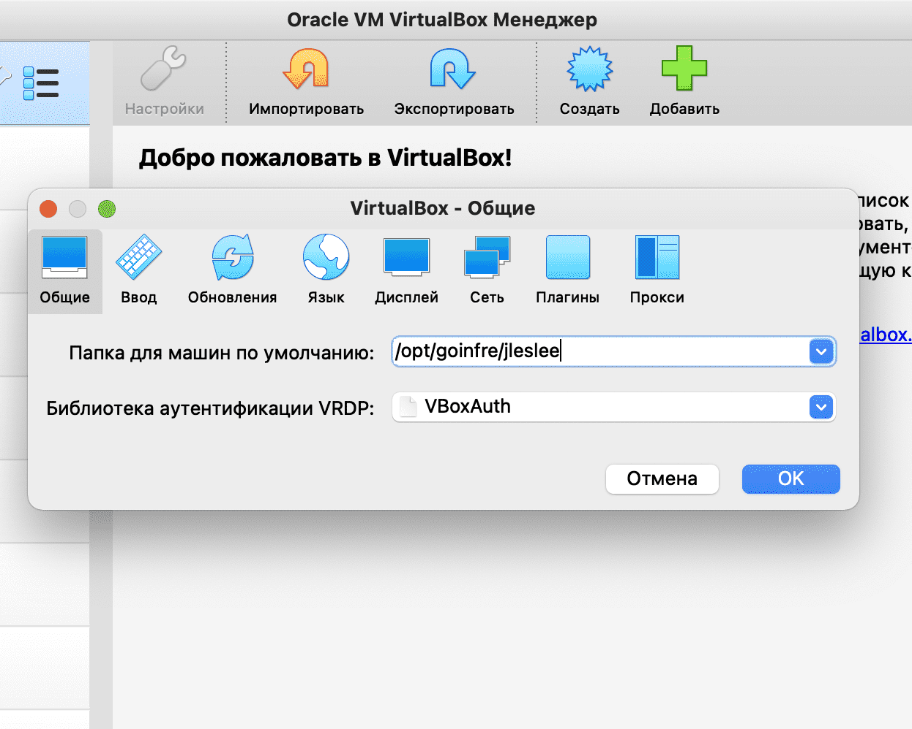
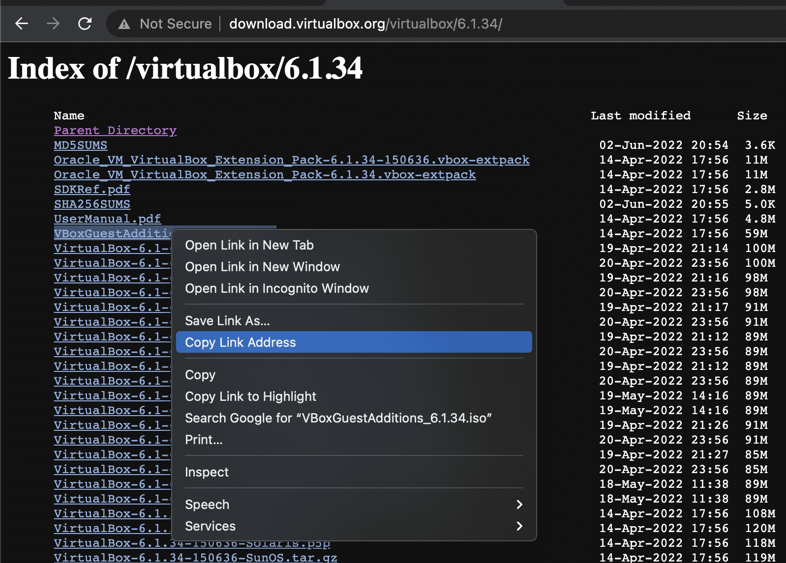
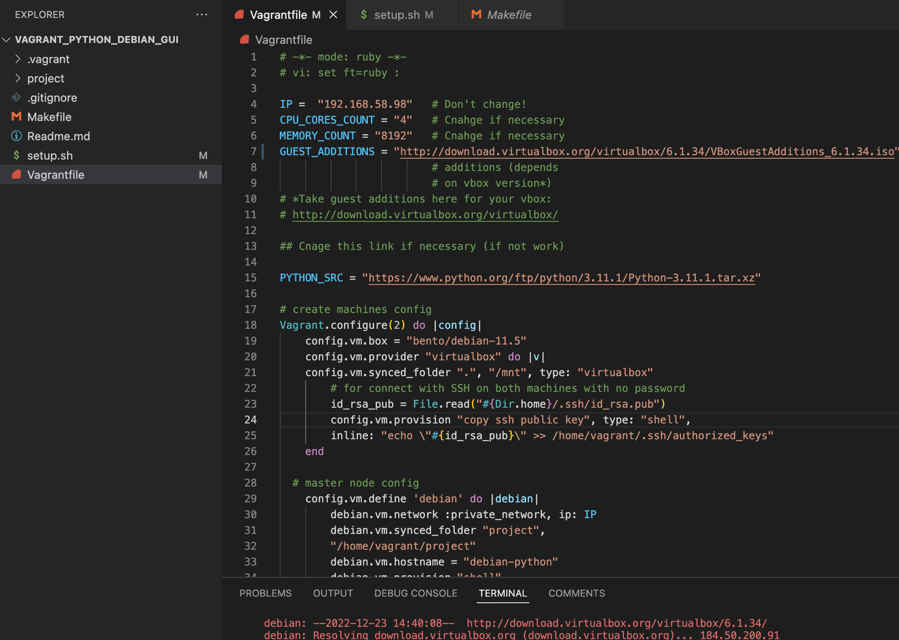
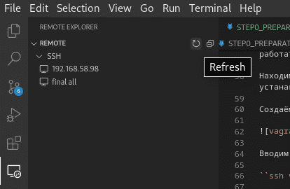
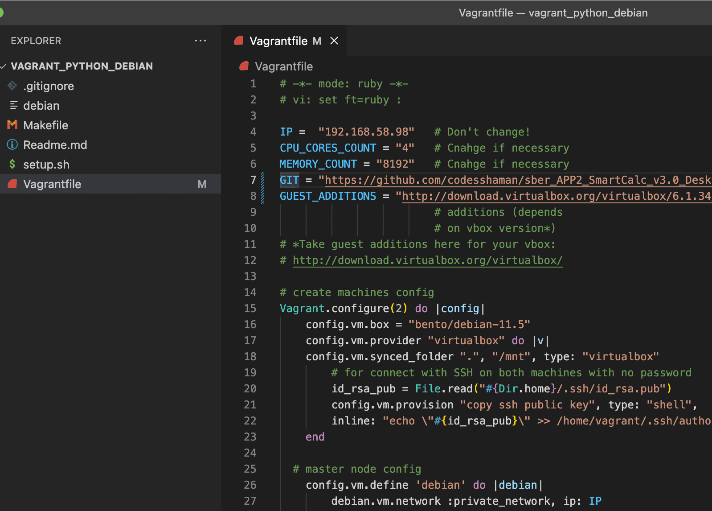

# Подготовка

По заданию среда, в которой мы будем работать - Python 3.11. Значит, необходимо настроить эту среду на тех ПК, на которых мы будем работать, желательно ещё и сделать эту среду переносимой чтобы не привязываться к одному рабочему месту.

Задача: 
- Запустить среду python-3.11 на любом компе без сложных танцев с бубном.
- По возможности разоворачивать эту среду быстро и на разных ПК.
Методы: 
- Установка brew. Пакетный менеджер brew работает только на unix-системах, стало быть, любой ПК с windows придётся настраивать отдельно.
- Использование виртуальной машины. Виртуализация доступна на любой платформе, виртуальная конфигурация переносима.

Попробовав настроить brew на школьном маке я пришёл к выводу, что работать через него крайне неудобно. Долгая установка, частые ошибки и необходимость постоянного запуска установочного скрипта на каждом новом маке с последующим ожиданием отталкивают.

А вот виртуальная машина с установленным python на текущем этапе кажется мне более предпочтительным вариантом. Именно его я выбрал для выполнения задач ветки питона.

### Шаг 1. Запуск конфигурации

Дабы создание виртуальной операционной системы не было сложным, я автоматизировал его при помощи vagrant. Vagrant - система конфигурирования среды виртуализации, позволяющая запускать виртуальные машины при помощи набора скриптов.

Сначала запустим центр приложений и установим vagrant:

Затем убедимся, что наш virtualbox сохраняет свои конфигурации в goinfre:

Иначе может не хватить памяти на школьном маке. На домашних машинах можно выбирать любой удобный раздел.

Специально под нашу задачу я подготовил конфигурацию vagrant на debian с python3.11. Скачаем её в goinfree:

``git clone https://github.com/codesshaman/vagrant_python_debian_gui.git``

Далее нам необходимо скачать образ debian11 с [vagrantup](https://app.vagrantup.com/bento/boxes/debian-11.5 "vagrantup"):

Скачиваем из строки с virtualbox и сохраняем в папку склонированного репозитория под именем debian.

Теперь редактируем Vagrantfile, изменив в нём переменные с выделенным процессором, памятью и ссылкой на гостевые дополнения. На школьных маках выделенные ресурсы можно не менять, а вот на более слабых ПК можно уменьшить количество выделенных ресурсов во избежании подвисаний. 

Далее проверим версию virtualbox на школьном маке. На момент написания гайда это версия 6.1.34, но всё может измениться. Идём на сайт [исходников virtualbox](http://download.virtualbox.org/virtualbox/) (в соответствии с синструкцией в комментариях), заходим в директорию своей версии virtualbox, клацаем правой кнопкой на файле гостевых дополнений и копируем адрес ссылки:

Заносим скопированную ссылку в переменную GUEST_ADDITIONS нашего Vagrantfile.

Нужно убедиться, что ссылка получилась именно вида

``http://download.virtualbox.org/virtualbox/<версия>/VBoxGuestAdditions_<версия>.iso``

Получилось примерно следующее:

Проверим так же, что у нас есть сгенерированный ключ id_rsa.pub в ~/.ssh, так как конфигурация vagrant будет использовать его для входа по ssh без пароля.

Так же склонируем наш проект в папку "project". Это общая папка, всё, что будет в ней, будет доступно внутри системы VM по пути ~/project.

Далее надо выполнить последовательно лишь две команды, находясь в корне репозитория vagrant_python_debian_gui:

``make build`` и ``make``.

Подробнее о других командах написано в Readme репозитория.

### Шаг 2. Открываем GUI конфигурации

Теперь в самом virtualbox открываем окно виртуальной машины. Поменяем разрешение в настройках (мне достаточно 200%):

Некоторое время (на моём школьном маке не более 3-4 минут) vagrant будет устанавливать необходимые пакеты внутрь виртуальной машины. При этом окно виртуальной маины будет мигать приглашением к логину.

Логиниться в ней не нужно. Дожидаемся окончания установки, и когда программа установки наконец доработает:

нужно будет перезагрузить систему любым удобным способом.

Через терминал можно залогиниться при помощи ``make connect`` и ввести ``sudo reboot``, но можно перезагрузиться средствами virtualbox:

После перезагрузки нас встретит окно логина. Логин и пароль - слово "vagrant". После логина загрузится легковесная среда окружения lxde.

Если хочется работать прямо в этом виртуальном окружении, можно в терминале установить ещё и браузер:

``sudo apt install firefox-esr``

Pycharm находится в системных программах, в меню разработки ряд программ для библиотеки QT.

Указываем pycharm-у путь непосредственно к папке src: (``~/project/<склонированный_проект>/src``). 

Точно так же быстро и удобно можно развернуть эту конфигурацию на любом другом компе.

Итак, пишем код и делаем комиты в gui виртуальной машины, пушим и пуллим с репозитория в отдельном терминале с хостовой машины. Звучит просто. Итак, приступаем к заданию!